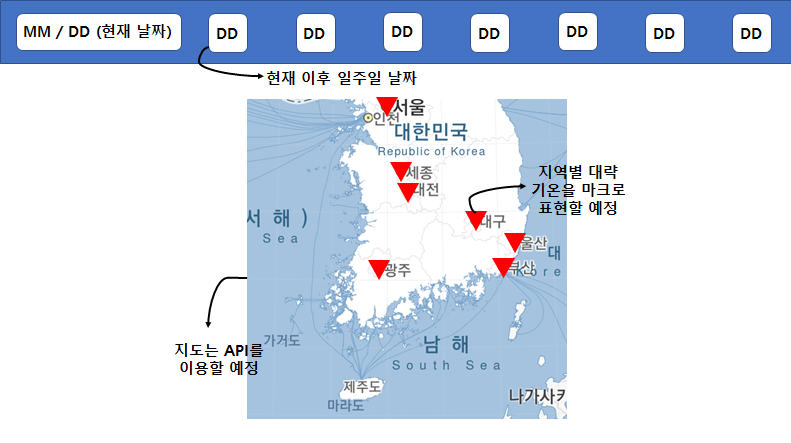

## 🌤️날씨별 옷차림 & 관광지 추천 시스템👗

<br/>

###  ✔ 시작가이드
#### ☂️ For building and running the application you need :
- mysql 8.0.34
- mongodb 4.4.22
- node.js 16.20.2
- npm 9.5.1
- Linux Ubuntu 20.04

#### ☂️ Installation
```
# git clone https://github.com/westmini427/Weatherdata-project.git
# cd source_codes
```
#### ☂️ Run
```
# apt install -y npm
# npm install -g nodemon
# npm init -y
# npm install express morgan path body-parser cookie-parser axios mongoose sync-mysql dotenv async
# nodemon app.js
```
<br/>

### ✔ 기술스택

|Category|Language|
|:--:|:--|
|OS| |
|Frontend|   |
|Backend| |
|Database| |

<br/>

### ✔ 프로젝트 개요

- 팀명 : 메이웨더
- 인원 : 2인 [ 서민희, 정지원 ]
- 기간 : 4일 [ 2023.04.24.(월) ~ 2023.04.27.(목) ]
- 문서 : Wireframe, Table configuration, API report, Architecture

<br/>

### ✔ 프로젝트 목적
- 데이터베이스를 활용한 웹 프로그래밍

<br/>

### ✔ 프로젝트 요약

- 날씨 데이터를 사용자에게 효과적으로 전달해줍니다.

- 날씨 데이터를 기반으로 옷차림과 관광지를 추천해줍니다.

- 날씨 데이터는 전국을 기준으로 수집하고, 인구가 많은 순으로 각 16개 지역의 데이터를 활용합니다.

- 기온의 범위를 정하여 각 기온의 범위 별 **옷차림**을 추천해주고, <br/>
놀러 가기 좋은 기온의 범위와 강수 확률, 미세 먼지 농도를 <br/>
임의로 설정하여 날씨가 좋다고 구분된 지역의 **관광지**를 추천합니다.

<br/>

### ✔ 개발 과정


- 데이터베이스 설계와 API 명세서를 설정 후, 이를 토대로 개발을 진행했습니다.

<br/>

### ✔ 초기 화면 구성


<br/>

### ✔ 실행 화면

